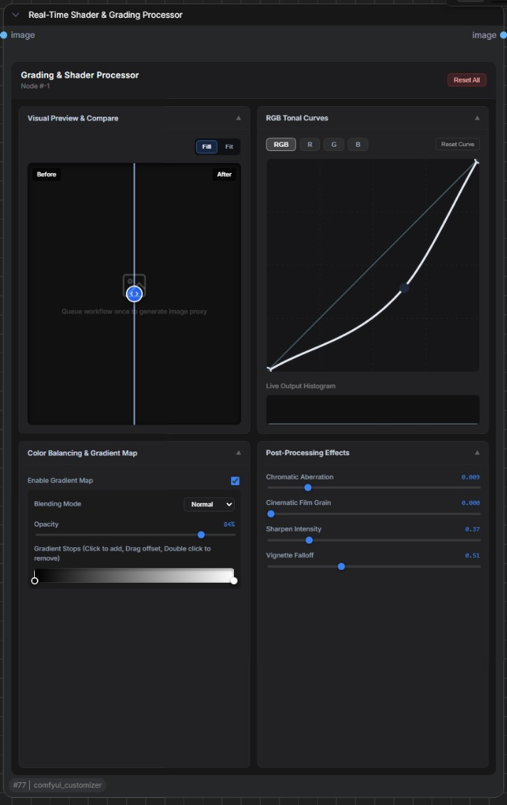

# Duffy Theme Control Panel (ComfyUI Nodes 2.0)

This repository contains a standalone custom node pack for ComfyUI Nodes 2.0.

## Included Nodes

- Duffy_ThemeControlPanel
  - Frontend utility node with no visible ports
  - Persists panel state in hidden socketless JSON
  - Applies global Nodes 2.0 styling with a versioned state model
  - Supports preset workflows (built-in and custom)
- Duffy_RealTimeGradingProcessor
  - Real-time post-processing and color grading node for IMAGE tensors
  - Persists grading controls in hidden socketless JSON
  - Applies RGB tonal curves, gradient map blending, and cinematic post effects
  - Emits compare preview thumbnails and histogram UI telemetry
- Duffy_LatentScalingCalculator
  - Dynamic latent resizer with aspect-ratio-locked scaling for LATENT tensors
  - Supports model-family factor selection (Flux 1, Flux 2, SD3)
  - Emits calculated target dimensions and validation warnings as UI telemetry
  - Includes a Vue-based interactive panel with live dimension previews

## Dynamic Latent Scaling & Dimension Calculator

Node ID: Duffy_LatentScalingCalculator

- Category: Duffy/Latent
- Display Name: Dynamic Latent Scaling & Dimension Calculator
- Inputs: LATENT samples, VAE, reduced_image_size, target_size, model_family
- Outputs: scaled LATENT, calc_width, calc_height

Feature overview:

- Aspect-ratio-preserving latent scaling based on source latent dimensions
- Architecture-aware spatial factor mapping (Flux 1 and SD3 use f=8, Flux 2 uses f=6)
- Floor alignment for reduced size and ceiling alignment for target size to keep VAE divisibility
- Built-in dimensional collapse protection for extreme aspect ratios or undersized inputs
- Channel-depth compatibility warnings surfaced to the frontend panel

Quick usage:

1. Connect a LATENT source to Duffy_LatentScalingCalculator.samples.
2. Select model_family to match the downstream diffusion architecture.
3. Set reduced_image_size for scaled latent generation and target_size for final dimension guidance.
4. Queue prompt, then read calc_width and calc_height outputs or view telemetry in the node panel.

## Real-Time Shader & Grading Processor

Node ID: Duffy_RealTimeGradingProcessor

- Category: Duffy/PostProcessing
- Display Name: Real-Time Shader & Grading Processor
- Input: IMAGE + hidden shader_params JSON
- Output: processed IMAGE

Feature overview:

- Before/After compare viewport with a draggable wipe control
- RGB master and per-channel tonal curve editing
- Color balancing via gradient map stops, blend mode, and opacity
- Post effects including chromatic aberration, film grain, sharpen, and vignette



Quick usage:

1. Add an image source node (for example, Load Image) and connect it to Duffy_RealTimeGradingProcessor.image.
2. Connect Duffy_RealTimeGradingProcessor.image output to your preview/save node.
3. Open the node UI and adjust curves, gradient map, and post-effects; the node writes settings to hidden shader_params automatically.
4. Queue prompt to process the image and view before/after compare thumbnails in the embedded panel.

Example shader_params payload (reference):

```json
{
  "chromatic_aberration": 0.08,
  "film_grain": 0.05,
  "sharpen": 0.35,
  "vignette_intensity": 0.45,
  "curves": {
    "rgb": [[0.0, 0.0], [0.5, 0.42], [1.0, 1.0]],
    "r": [[0.0, 0.0], [1.0, 1.0]],
    "g": [[0.0, 0.0], [1.0, 1.0]],
    "b": [[0.0, 0.0], [1.0, 1.0]]
  },
  "gradient_map": {
    "enabled": true,
    "blending_mode": "Normal",
    "opacity": 0.84,
    "stops": [
      { "offset": 0.0, "color": "#111111" },
      { "offset": 1.0, "color": "#F2F2F2" }
    ]
  }
}
```

## v2 Highlights

- Versioned state contract: schemaVersion = 2
- Legacy state migration: old flat panel JSON is automatically normalized into v2 namespaces
- Expanded palette groups:
  - uiMeta (typography, preview-facing node colors, outline mode)
  - litegraphBase (node/widget/link/badge colors)
  - comfyBase (shell colors)
  - nodeSlot (slot type colors)
- Preset operations:
  - Apply built-in presets
  - Save and remove custom presets
  - Export and import custom preset JSON
- Multi-node warning: if multiple Theme Control nodes are present, runtime warns about global override behavior

## Folder Layout

- nodes/: Schema V3 backend node definitions
- src/: Vue + TypeScript source
- web/: built frontend extension assets served by ComfyUI
- fonts/: user-provided custom fonts (.ttf, .otf, .woff, .woff2)
- plans/: implementation plans and rollout documents

## Build Frontend

1. Install dependencies:
   npm install
2. Build frontend assets:
   npm run build

## Backend Routes

- GET /api/duffy/theme_fonts
  - Returns available fonts from the fonts directory
- POST /api/duffy/theme_fonts
  - Uploads one custom font file using multipart/form-data with field name font
  - Supported formats: .ttf, .otf, .woff, .woff2
  - Max upload size: 5 MB per file
- DELETE /api/duffy/theme_fonts/{filename}
  - Deletes one custom font file from the fonts directory
- /custom_theme_fonts/*
  - Static route for font file delivery

## Custom Font Workflow

- In the Theme Control Panel, use Upload Font to add a font file to the local fonts directory.
- Uploaded fonts are discovered immediately and appear in the Font Family dropdown.
- Use the delete control in the panel to remove a custom font.
- If a deleted font is currently selected, the panel falls back to the default family (Arial).
- Custom fonts are local-only: preset export/import stores the font family name, not the font file binary.

## Notes

- Target runtime is ComfyUI Nodes 2.0 with Schema V3.
- Extension architecture is Vue-first and does not implement a legacy canvas fallback.
- Theme application remains global by design.
